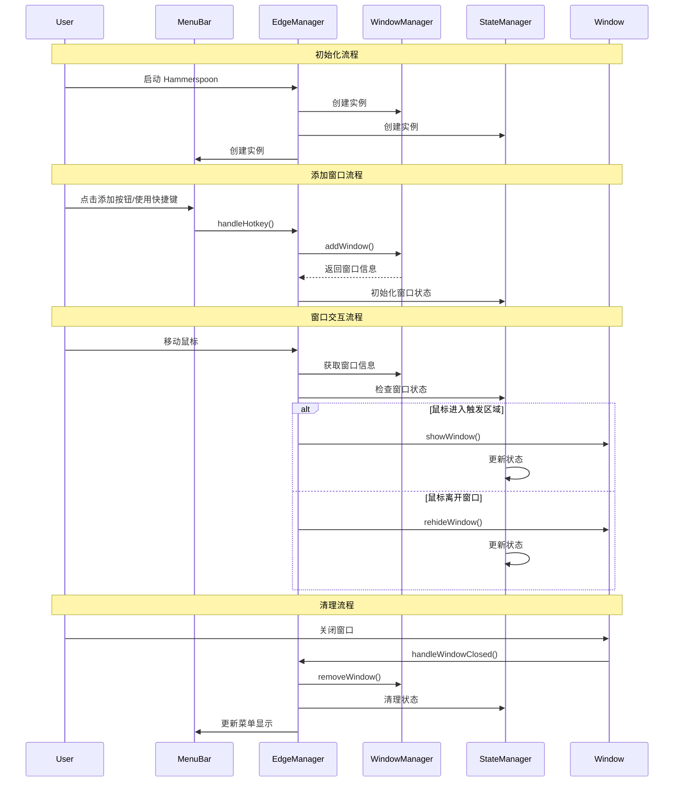

# Hammerspoon Window Management Workflow

## 完整流程说明

### 1. 初始化阶段
- 系统启动时，通过 `init.lua` 初始化 `EdgeManager`
- `EdgeManager` 创建了 `WindowManager`、`StateManager` 和 `MenuBar` 实例
- 设置窗口过滤器和鼠标监听器

### 2. 窗口添加流程
可以通过两种方式添加窗口：
1. 使用菜单栏的按钮（左侧或右侧）
2. 使用快捷键触发 `handleHotkey` 函数

当添加窗口时：
- 记录窗口的原始位置（originalFrame）
- 计算窗口在边缘的位置（edgeFrame）
- 计算窗口隐藏时的位置（hiddenFrame）
- 计算触发区域（triggerZone）
- 保存当前窗口所在的空间（space）

### 3. 窗口交互流程
#### 鼠标触发显示：
1. `handleMouseMove` 持续监控鼠标位置
2. 当鼠标进入触发区域（triggerZone）时
3. 经过短暂延迟（0.1秒）确认后
4. 调用 `showWindow` 显示窗口

#### 窗口隐藏：
1. 当鼠标离开窗口区域时
2. 通过 `leaveWatcher` 检测
3. 调用 `rehideWindow` 隐藏窗口

### 4. 状态管理
`StateManager` 负责跟踪：
- 窗口是否隐藏（isWindowHidden）
- 窗口是否正在移动（isWindowMoving）
- 窗口的当前状态

### 5. 特殊情况处理
#### 窗口关闭：
- 清理相关的监听器（leaveWatcher）
- 从 WindowManager 移除窗口记录
- 清理状态管理器中的状态
- 更新菜单栏显示

#### 空间切换：
- 支持独立空间模式（ALONE_SPACE）
- 在切换空间时保持窗口状态

### 6. 动画和过渡
- 使用 `ANIMATION_DURATION` 控制窗口移动动画
- 设置 `EDGE_PEEK_SIZE` 控制边缘露出的大小
- 使用 `MOVE_THRESHOLD` 判断窗口移动的有效距离

### 7. 清理流程
当窗口被移除时：
1. 停止所有相关的监听器
2. 恢复窗口到原始位置
3. 清理所有状态记录
4. 更新菜单栏显示

## 时序图

